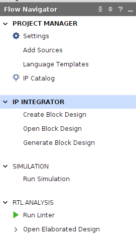
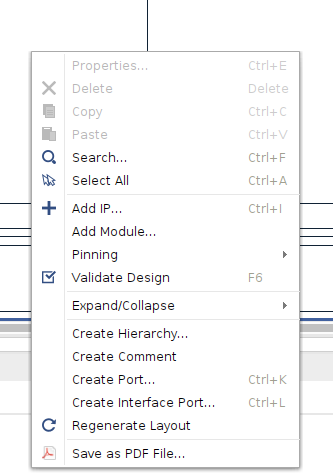
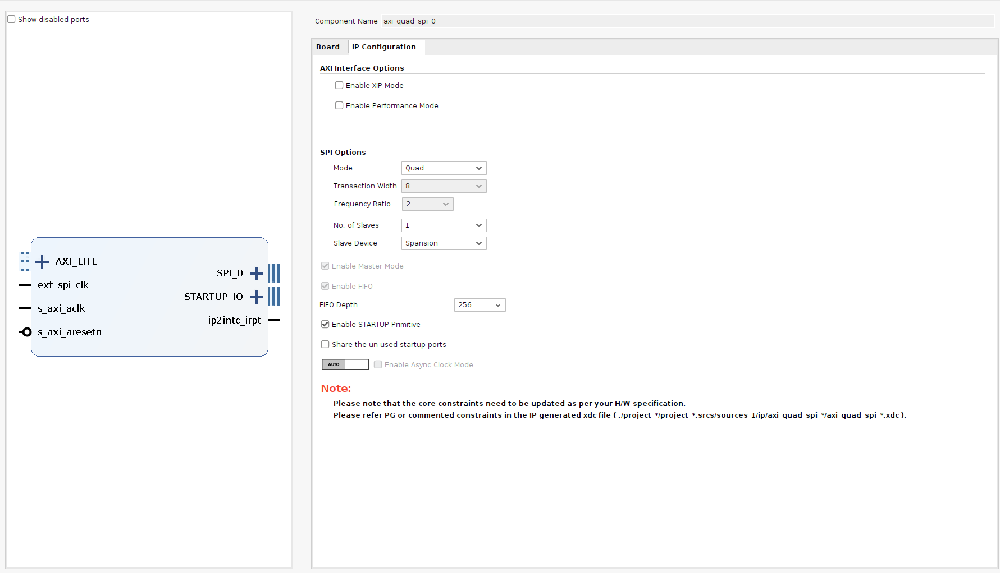
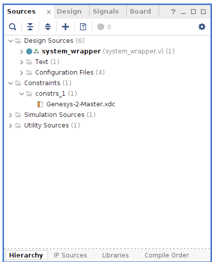
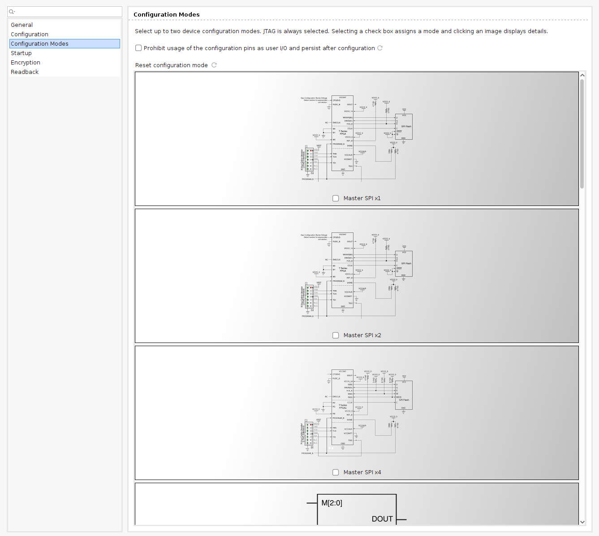
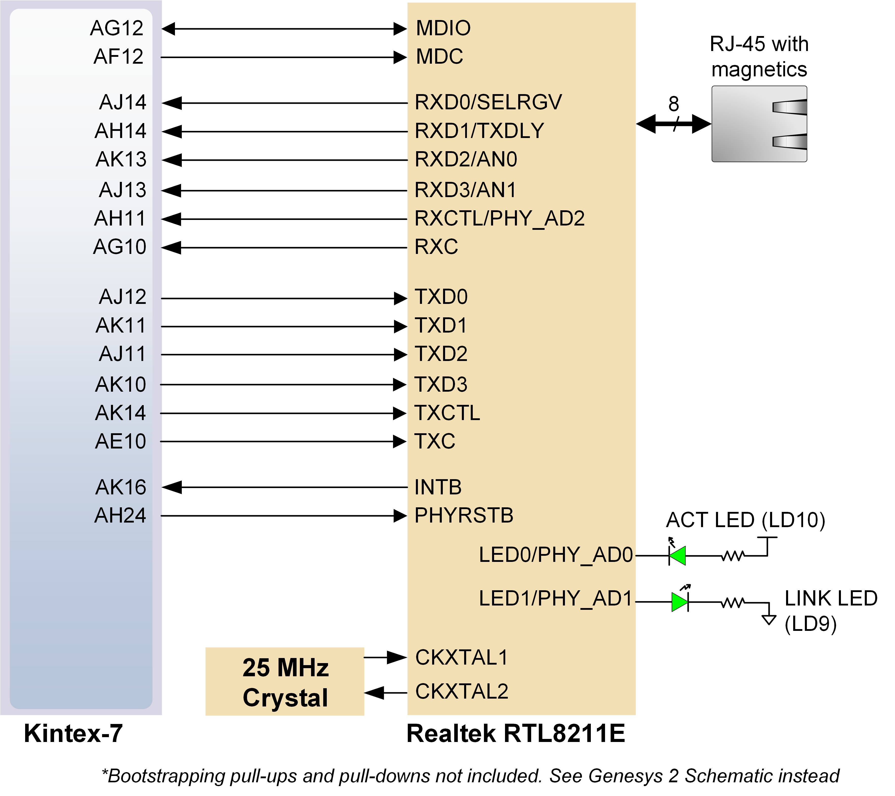
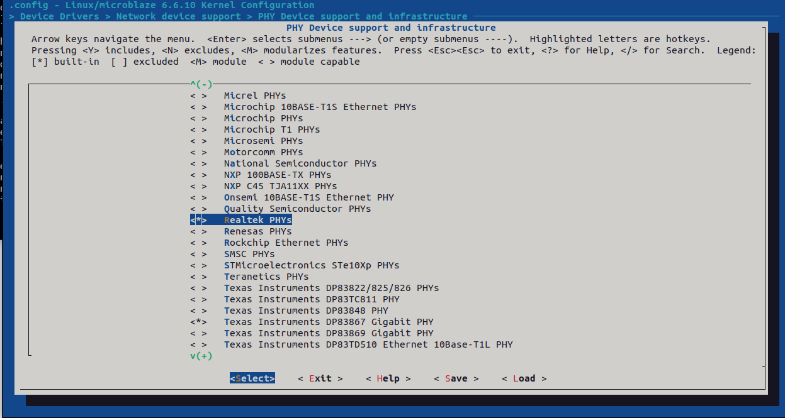
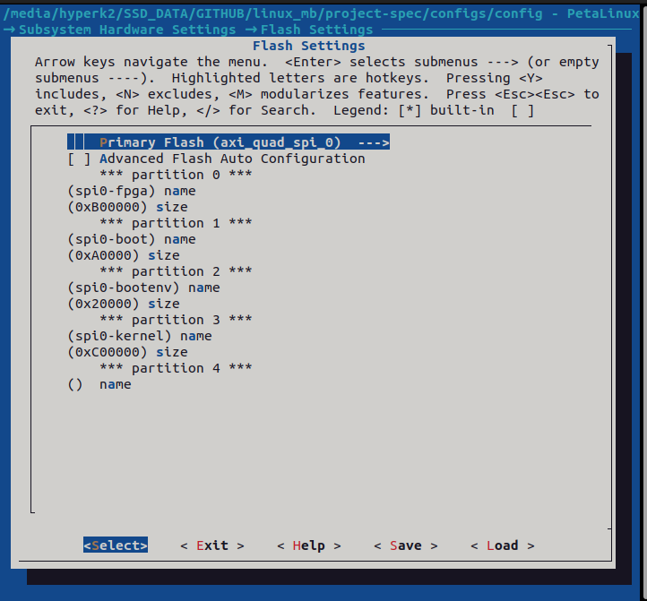
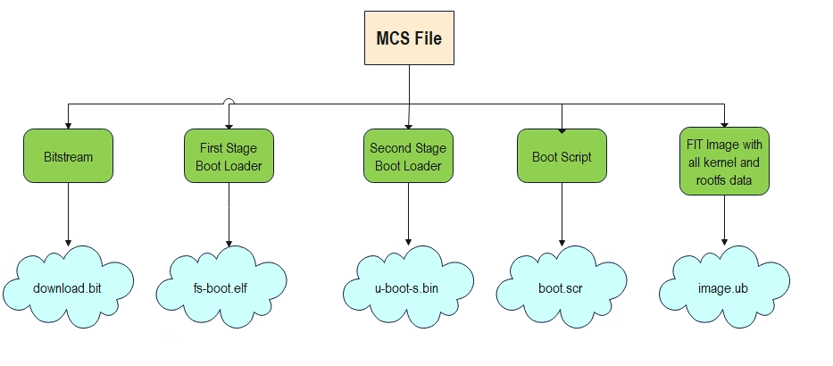
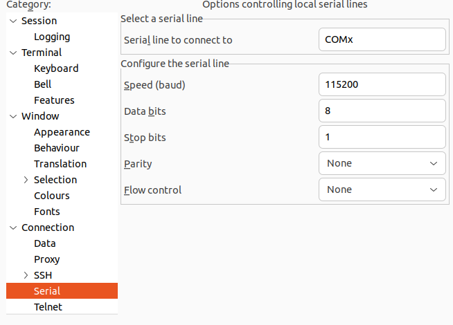

# SESSION 1: MICROBLAZE PLATFORM FOR PETALINUX
In this first session we are learning on how to generate from zero (to hero) a Petalinux system using the AMD Software for FPGA development. The platform will be based on the classic Microblaze architecture with many peripherals attached to it, as we have sen in the theory sessions.

!!! danger Deliverables
      At the end of this session you will have to deliver three things:
      - The Question paper with all the questions answered. They will be developed through the lab session
      - The XSA file from Vivado
      - The screenshot of the address editor
## PART 1: BUILDING THE MICROBLAZE PLATFORM IN VIVADO

For this section, only Vivado 2024.1 software is needed.

1. Download the archived project from PoliformaT and unzip it in a folder of your choice.

!!! warning 
      UNZIP THE FOLDER IN A PATH THAT IS NOT VERY LONG AS WINDOWS CAN COMPLAIN ABOUT THIS!

1. Open Vivado and click on Open Project.
2. Go to the folder where the project was unzipped and open the *.xpr* file to open the Vivado project.
3. Follow the instructions in the next sections to complete the Vivado project, making it ready for booting up Linux.

### Including QSPI Controller

The project is almost completed, only one IP block is left: The QSPI controller.

!!! question "Question 1"
    Why is the QSPI controller needed?

1. Click on *Open Block Design* in the IP Integrator section.
   
2. Right click in an empty part of the Diagram screen and click on *Add IP*.
   
3. Select AXI Quad SPI.
4. Double click on the IP and configure the IP as shown in the photo.
   

!!! question "Question 2"
    How is it known that the Mode must be Quad and the Slave Device Spansion?  
    Tip: Look at the Genesys 2 reference manual for the QSPI flash model.

5. Connect the IP to the following ports. For that just hold click on the port and draw the cursor to the destination port where you want to connect the first port to:
   - AXI_LITE -> M02_AXI of AXI Interconnect
   - ext_spi_clk -> ui_clk from MIG 7 Series
   - s_axi_aclk -> ui_clk from MIG 7 Series
   - s_axi_aresetn -> peripheral_aresetn from rst_mig_7series_0_100M 

### Analyze Microblaze processor and memory map

In this section we are going to edit the Microblaze processor:

1. Double click on the Microblaze processor.

!!! question "Question 3"
    What is needed for the Microblaze to run Linux?

2. Go to the cache page and increase the cache to 64kB.

!!! question "Question 4"
    Check the Base Address and High Address values in the Instruction and Data Cache.  
    Where are these values drawn from? What do they represent?

3. Go to the Address Editor tab.
4. Right click and in the contextual menu click on *Assign All*. This will assign physical memory spaces in the addressing space of the CPU.

!!! question "Question 5"
    Change the Available internal memory of the CPU from 8kB to 64kB.  
    What effect will this cause in our design? What is it useful for?

5. Make a screenshot expanding all the elements from the address editor and attach it in the PoliformaT task.

### Editing Constraints

Add the following constraints to the XDC file. The XDC file is in the Sources section, Constraints folder.
   
```tcl
set_property BITSTREAM.CONFIG.SPI_BUSWIDTH 4 [current_design]
set_property BITSTREAM.GENERAL.COMPRESS TRUE [current_design]
```

!!! question "Question 6"
    What do the previous commands do?

### Select bootup method

1. Run Synthesis of the design.
2. Tools -> Edit Device Properties -> Configuration modes -> Master SPIx4.
   

### Generate bitstream

1. Click on Generate Bitstream to go through the whole build process.
2. Open Implemented Design.
3. Click on *Report Utilization* and check the utilization report to see which FPGA resources were used.
4. Attach a screenshot of the Summary section of the Utilization Report.

### Generate XSA file

1. Go to File -> Export -> Export Hardware.
2. Check *Include Bitstream*.
3. Select where you want to save the XSA file.
4. Click Next several times and Finish.

!!! question "Question 7"
    What does this file include?  
    Tip: Open it using 7zip.

## PART 2: GENERATING AND BOOTING PETALINUX IMAGE

In this section, we are going to build a custom Linux image using the Vivado XSA. The software that will be used are the Petalinux Tools 2024.1.

1. Connect to the Linux VM...
2. Run the script that configures the environment for Petalinux building commands.
3. Create the Petalinux project. This project will be the center of all the changes made in the software for building the Linux platform and software that comes with it.
```shell
petalinux-create -t project -n linux_mb_2024 --template microblaze
```

!!! question "Question 8"
    What options are there for the template argument?  
    Check UG1144 Petalinux Tools Reference Guide.

4. We have to tell Petalinux which hardware we have so that the correct software and drivers components are built. As the in the FPGA we can include any hardware that our imagination (and our Verilog coding skills) allow us, Petalinux Tools need to know exactly what we included and what not.
```shell
petalinux-config --get-hw-description <folder where the xsa was copied> --silentconfig
```

### Configuring the linux kernel

5. There is one hardware added: the Ethernet link that requires additional drivers because there is a PHY chip in the board that negotiates the link. This is a Realtek chip that has their own set of drivers.  
Run the following command to enter into the kernel customization menu:
```shell
petalinux-config -c kernel
```
   

6. You will be presented with a Kconfig menu that allows to configure every single part of the Linux kernel, to tune it to the developer needs. Go to the corresponding section by using the arrow keys and the *Enter* key and check the Realtek PHY support using the *y* key:
```
> Device Drivers > Network device support > PHY Device support and infrastructure
```
   

### Boot flow, configuring offsets

Let's analyze the boot flow. Petalinux will boot from the QSPI flash, using the bootflow that we saw in the slides. For that it will need several files and each one of them must be in a specific offset that we are configuring the Petalinux boot flow to find that file. To configure those offsets the following steps must be made:

7. Go to the main Petalinux configuration screen:
```shell
petalinux-config
```

8. Navigate through the menu to the qspi offset section:
```shell
 → Subsystem Hardware Settings → Flash Settings
```

9. Configure the offset using the following options:
   

!!! question "Question 9"
    What does each partition represent? Fill the table below.
    How is the required size of each partition computed?

| Partition    | Size     | Description |
|--------------|----------|-------------|
| spi0-fpga    | 0xB00000 |             |
| spi0-boot    | 0xA0000  |             |
| spi0-bootenv | 0x20000  |             |
| spi0-kernel  | 0xC00000 |             |

### Editing the device tree

Including a new driver means that we need to configure it. This is done through the device tree, as explained in the theory slides. For this lab session we are going to configure the Realtek PHY included in the Genesys 2:

10. In the project folder, go to `project-spec/meta-user/recipes-bsp/device-tree/files`.
11. Open the *system-user.dtsi* file.
12. Add the following lines of text to the file:
```dts
&axi_ethernet_0 {
    phy-handle = <&phy0>;
    axi_ethernet_0_mdio: mdio {
        #address-cells = <1>;
        #size-cells = <0>;
        phy0: ethernet-phy@0 {
            device_type = "ethernet-phy";
            compatible = "ethernet-phy-id001c.c915";
            reg = <1>;
        };
    };
};
```

!!! question "Question 10"
    What does the compatible property and the reg property represent?

!!! question "Question 11"
    Where can you get the information of what to write in the compatible and the reg property?

### Bootup Petalinux

The project is completely configured. Now let's build an image and flash it into the Genesys 2 board.

14. The command for building Petalinux images is `petalinux-build`. However, do not run it, as it takes very long to run. We are going to use a prebuilt image.
15. For completeness, there is another command, called `petalinux-package`, that takes all the outputs from the previous one and puts it inside an MCS (Memory Configuration System) file. This file is used to initialize the QSPI flash inside the Genesys 2 board with all the required files for booting Linux.

   

!!! question "Question 12"
    Open the MCS with a text editor. What do you find inside?

PONER AQUI TODAS LAS CAPTURAS

1. Open Vivado 2024.1 and go to Hardware Manager.
2. Click on Open Target -> Auto Connect.
3. Right click on the FPGA device found (kcu7) and click on *Add Configuration Memory Device*.
4. In the window, select the correct memory device: *s25fl256xxxxxx0*.
5. Click OK and say Yes to the message prompting you to program the memory device.
6. Check the MCS option in the next window and add the boot.mcs boot file that you have to download from PoliformaT.
7. Click OK and wait for the device to be programmed.
8. Once programmed, open Putty and select the serial terminal with the following options:
   - Serial Line: COMx (check in device manager)
   - Speed: 115200
   - Bits: 8
   - Stop bits: 1
   - Parity: None
   - Flow Control: OFF

   

24. Turn off and back on the board and wait for Petalinux to boot.

### Running some commands in Petalinux

Once in the login prompt, enter the `petalinux` user and then write a new password when asked by the system.

!!! question "Question 13"
    Run the following commands and copy and paste the output:  
    - `cat /proc/cpuinfo`  
    - `cat /proc/meminfo`  
      What kind of information does each one of these commands show?