# SESSION 2: SOFTWARE COMPONENTS OF PETALINUX
In this session we are learning on how to take advantage of the system we have built with our own hands in the previous session.

Linux is not just some piece of static fancy software that is running on a computer so that you can show off to your friends...

In this session, we are going to learn how to edit every single piece of code, used from the buildup of the kernel, going thorugh the bootloader process to the final enduser software that will be running in our platform.

Also, if time is on our side and the Fortune Goddess smiles us, we can also learn how to add the end software after having being tested, to a prebuilt Linux image so that the end user doesn't have to worry about downloading any extra packages.

!!! danger Deliverables
      At the end of this session you will have to deliver three things:
      - The source code of the GPIO application
      - The .elf file, ready to be executed in the Genesys 2

## Patching the bootloader
Before entering into coding a new application for ourselves, we will enter into the world of patching, that is, picking some code and changing it to our liking to add new features or fixing nasty bug.

In Petalinux Tools, or in Yocto, in general there is the devtool concept, where the tools will download a specific source code of a software and will leave it inside the project locally so that you can change whichever part of the code you want.
Then, after the changes have been made, when issuing the `petalinux-build`, instead of pulling the source code from the repository, the local copy with your changes will be used.

This is a very convenient way to test small changes done to other people software without having to pull their repositories in a separate directory, all of this is already integrated inside Yocto.

We are going to patch the bootloader of Microblaze, defined as the first piece of software that the Microblaze CPU runs when booting up the system. This bootloader is a very small piece of software that must fit into the BlockRAMs, so having as few code as possible and as optimized as possible for our use case is crucial:

1. Pull the source code using `petalinux-devtool`
   ```shell
   petalinux-devtool modify fs-boot
   ```
2. The previous command will download the source code in `components/yocto/workspace/sources/fs-boot`. Go to that folder
3. There, you will find the source code of the first stage boot loader. The main() function of this bootloader is in `components/yocto/workspace/sources/fs-boot/lib/sw_apps/mba_fs_boot` Open the file *fs-boot.c*
4. Make some modification like for example adding a printf at the beginning of the main().
5. Now, we could build the petalinux image and test this change, no more steps are needed. However, we are going to complete the flow now.
6. The pull that devtool does gives a repository as a result, meaning that when you make changes you can commit them. Each one of these commits will be transformed into a .patch file.
   ```shell
   git add -A
   git commit -m "My Patched changes"
   ```
7. Once the commits are done, run the other relevant `petalinux-devtool`command variant:
```shell
petalinux-devtool finish fs-boot <absolute route to the project>/project-spec/meta-user
```
8. Now, inside `project-spec/meta-user/recipes-bsp/fs-boot`, there should be a .patch file for each commit file you made. Find in the following link an example of a [patch file](https://github.com/Xilinx/embeddedsw/commit/08ebf27b381f3f21a9e961363d3a9505e3d49a21.patch)

## Coding applications in Vitis
AMD provides an Integrated Development Environment (IDE) for their FPGA solutions, where all the tools needed for building and debugging software are included. This software is called Vitis.

In this section, you will code an application for the Microblaze CPU that you built in the previous session. The statement is as follows:

!!! abstract Application coding
    Code an application that takes the value of the switches through the GPIOs and puts it directly into the LEDs above the switches in the Genesys 2 board

To code this application, please take a look into how GPIO works in Linux through sysfs.

1. We are going to need both the XSA from Vivado 2024.1 and a SDK that contains the Microblaze crosscompiler and the sysroot. Download both the XSA and SDK.zip from PoliformaT.

!!! info About sysroot
     It is a directory which is considered to be the root directory for the purpose of locating headers and libraries. It is a directory that contains a full linux rootfs made for the target architecture of the CPU, so it contains all the libraries (.so) and headers (.h) files specially made for that architecture.
    
!!! danger 
    The sysroot is completely needed as we CANNOT use the libraries included in the host OS because they are made for a different architecture (x86).

2. Extract SDK.zip in a folder of your choice
3. Open Vitis Classic 2024.1
4. Choose the workspace you want to work in (recommended to leave the default one).
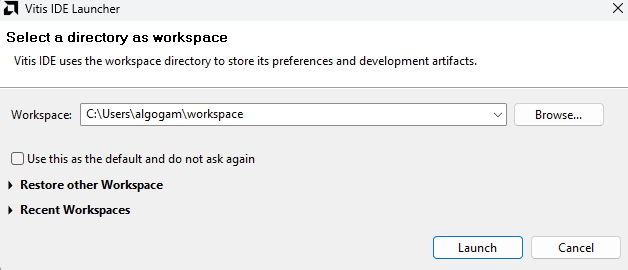

5. Create a platform project
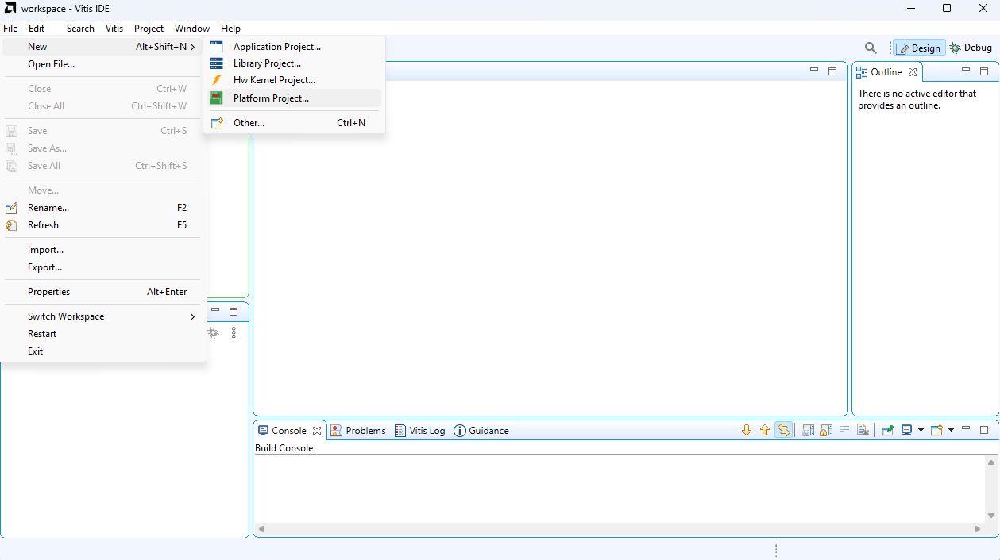

!!! info About a platform project
    The platform project is the project that contains all the hardware information of the board and the type of OS it is running (linux, freertos or standalone). This information is gathered from the XSA generated by Vivado. For Linux, more information is required, such as the sysroot.
6. Select the XSA that you downloaded previously.
   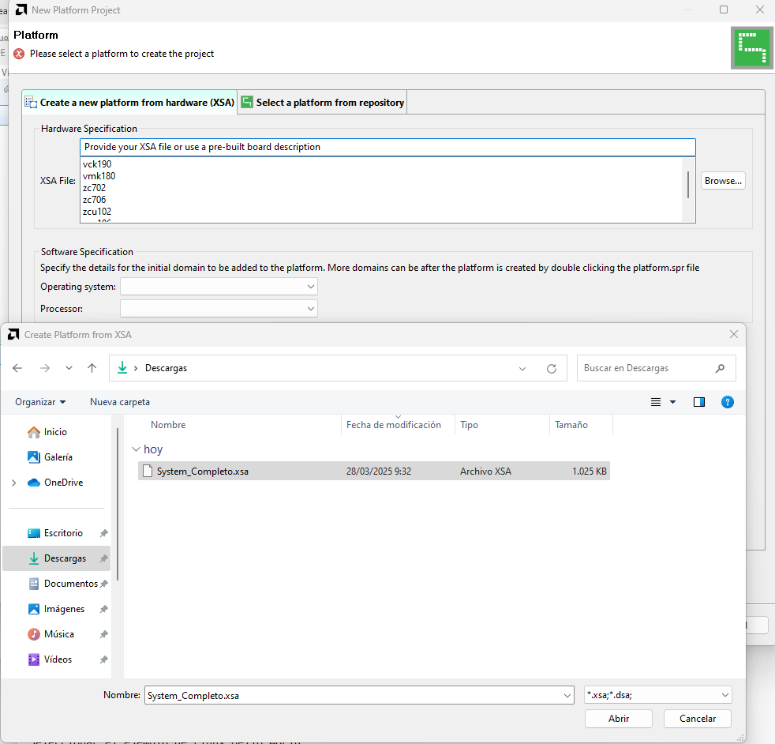
7. When the Software specification loads, select in the Operating system dropdown *linux*.
   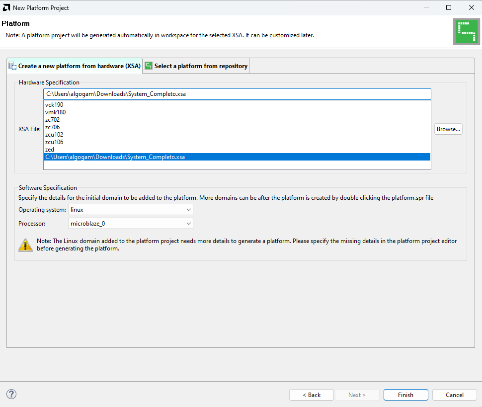
8. Click Finish to create the platform project
9.  Click on platform.spr and then go to the Linux on microblaze_0 section.
10. Search for Sysroot and click the Browse button next to it.
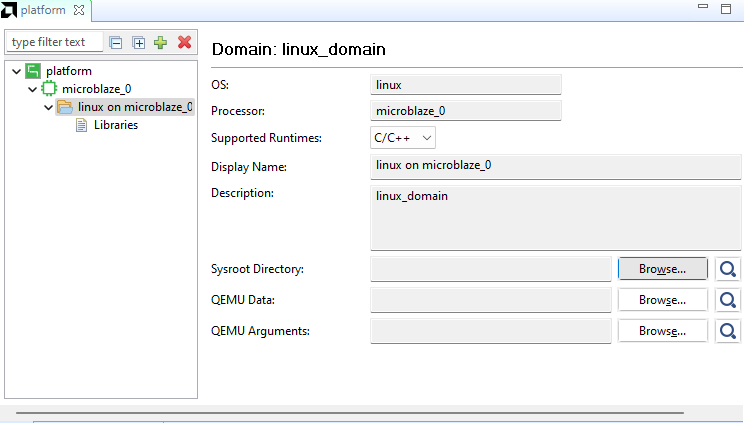
11.  Go to the folder where you unzipped the sdk.zip file and select ``<sdk-directory>/sysroots/microblazeel-v11.0-bs-cmp-re-mh-div-xilinx-linux``
    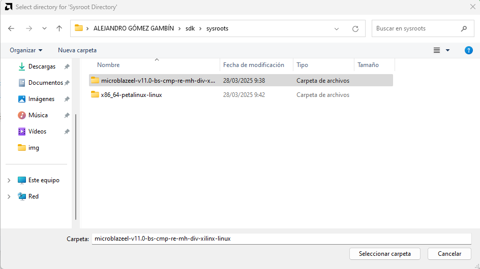
12.  Build the platform project by clicking on the *hammer* icon.
13.  Create the application project.
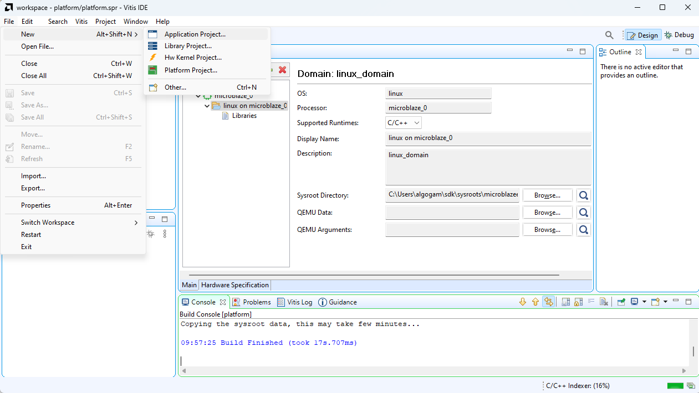
14. Select the platform project created before in the following screen:
    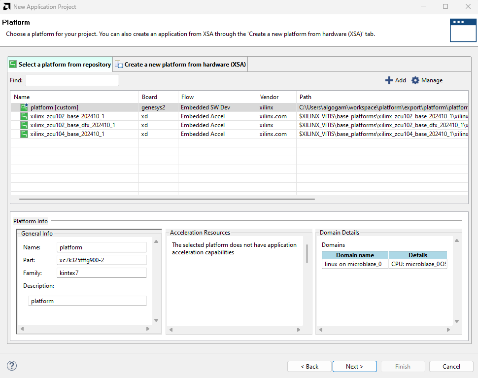
15. Click Next and input a name for the system project.
16. Click Next again until you reach the following screen. Select as template the *Linux Hello World*
    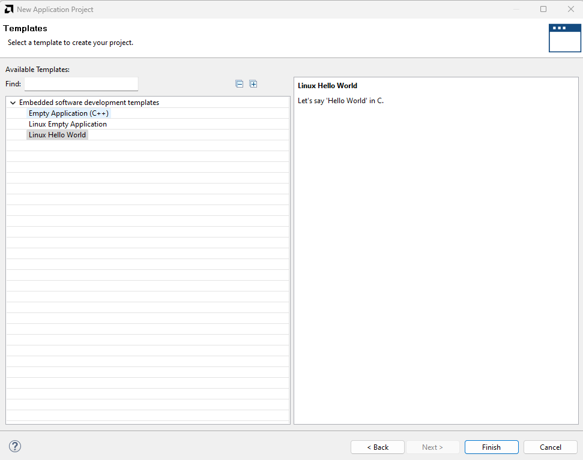
17. Click Finish to create the application project
18. Build the application project using the *Debug* profile.
    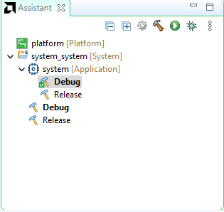
19. Once built go to the Run button, dropdown list and click on Run Configurations...
    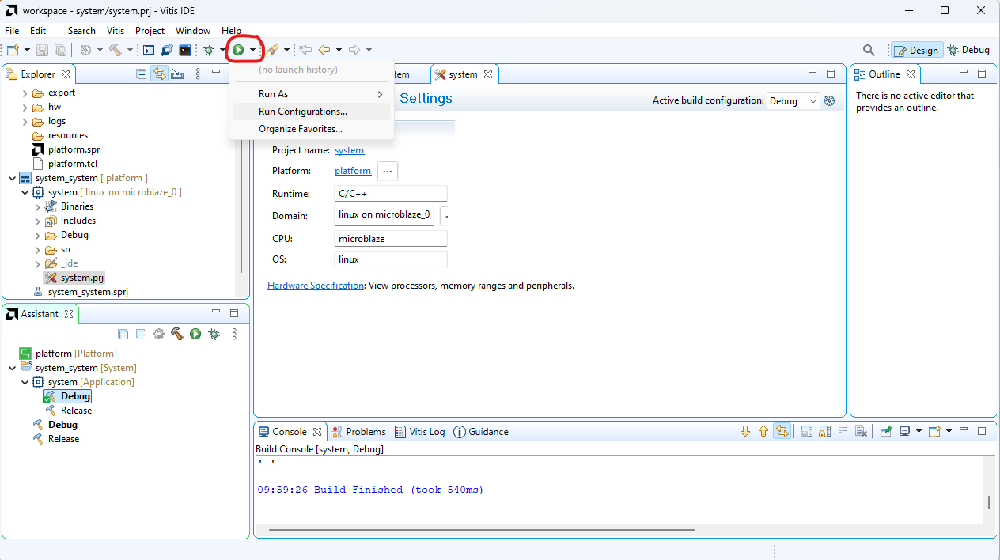
20. Create a new configuration of type TCF (Single Application Debug).
    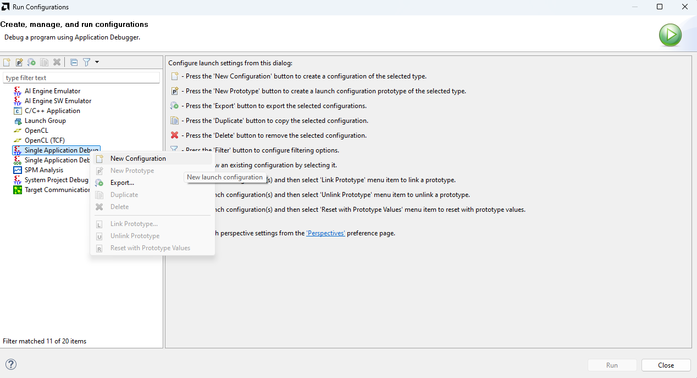
21. In the Main tab
    - Add a new Agent with the Ip address of the Genesys 2 board (40.0.0.2).
    - Click on Test Connection and ensure that it succesfully establishes connection.
  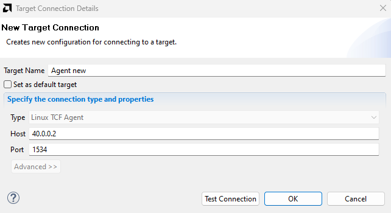

  !!! info About TCF agent
    The TCF agent is a software included in the Petalinux distribution by default which acts as a bridge between the PC and the board. This allows to transfer, run and debug applications through ethernet, removing the need of connecting a JTAG cable.
    For more information about the TCF agent go to [AMD Docs](https://docs.amd.com/r/en-US/ug1144-petalinux-tools-reference-guide/Debugging-Applications-with-TCF-Agent) 
22. In the Application tab
    - Change the working directory to ``/home/petalinux``
    - Change the remote directory to ``/home/petalinux/<name-of-the-.elf>``
23. Click Apply and then Run.
24. The Output terminal of the application should automatically open below and display the *Hello World*.
     
!!! tip How does the application work?
  
    The message *Hello World* is printed by the application by the board to stdout using printf, then the TCF agent connects stdout of the application to the PC, so the message is displayed on the PC.
## Debugging applications in Vitis
Besides just running your application, you can also debug it step by step.
This is done in exactly the same way as when running normally your application, but instead of clicking on *Run*, click on *Debug* and the debugging interface should appear, breaking at the start of the main() function.

!!! note 
    You can put breakpoints by double clicking on the lines of the editor, just like in any another editor.

!!! warning
    In case your application is not entering debug mode, make sure to disable any optimization flag (-O0) and enabling the debug information flag (-g3).

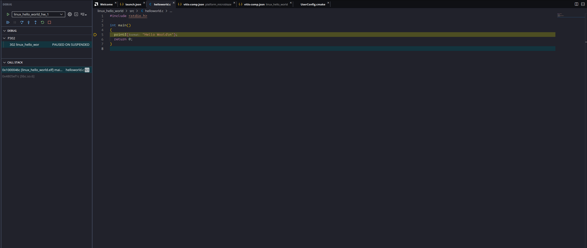

## EXTRA: adding your software to a production image
If you have reached this section before the session ended, congratulations! This last section is dedicated to including your source code that you made on Vitis in the previous section inside the Petalinux image, so that it is readily available to anyone that flashes your OS image (the .mcs file) without having to transfer the application afterwards through ethernet like we did.

Petalinux Tools is Yocto based, meaning that it works through recipes. To add a new software component, we need to add a new recipe. The steps are as follows:
1. Create a new application recipe:
```shell
petalinux-create -t apps --template c -n my-gpio-app --enable
```
2. The new application source code should be created in `project-spec/meta-user/recipes-apps/my-gpio-app`. Inside this folder there should be a .bb file and a folder called files. Open the files folder.
3. Copy all your source code files inside the `files` folder, erasing all the .c and .h files that were there, MAKING SURE THAT YOU LEAVE THE MAKEFILE.
4. Open the aforementioned .bb file. This file contains a list of all the files that will be used to build your application in the form of an environment variable called SRC_URI.
5. You need to point all the files you included in the SRC_URI files using the URI format that is usually used in web browsers, so `file://<file-name>`. These files are taking with respect to the route of the `files` folder so, if the files are already in the `files` folder, and not in any subdirectory, you just have to specify the file name. 
6. After that, we can make a quick test to see if our application is building correctly. This can be done by using the `petalinux-build` command with a -c parameter which indicates that we only want to build a specific component of our system. The name that you put in the -c, is the same as the one you used to create the application in step 1.
```shell
petalinux-build -c my-gpio-app
```
7. If the application built successfully, congratulations! you got your application included in the root file system of your Linux image. This means that, if you make a new .mcs file after running petalinux-build, you will get this application directly included in your rootfs.