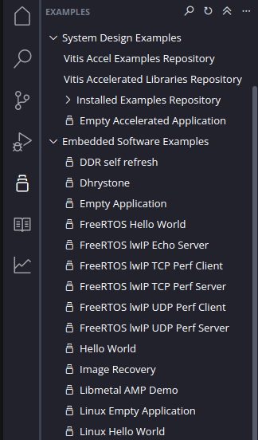
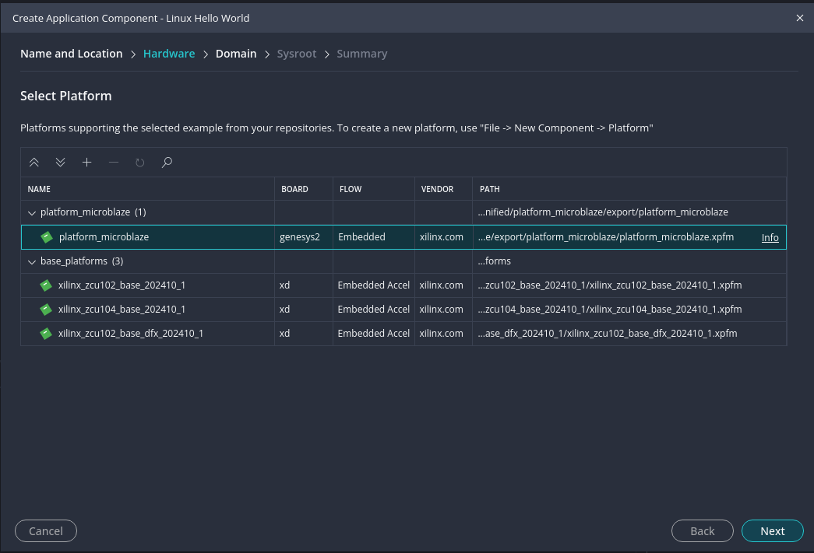
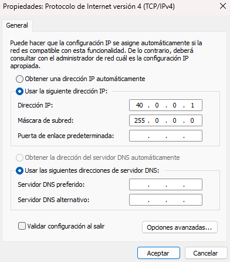
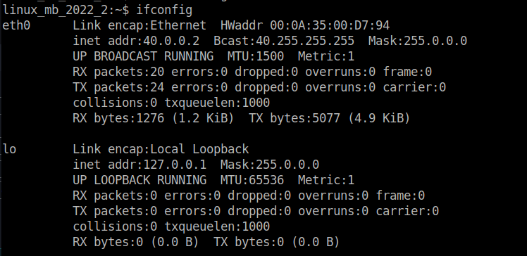
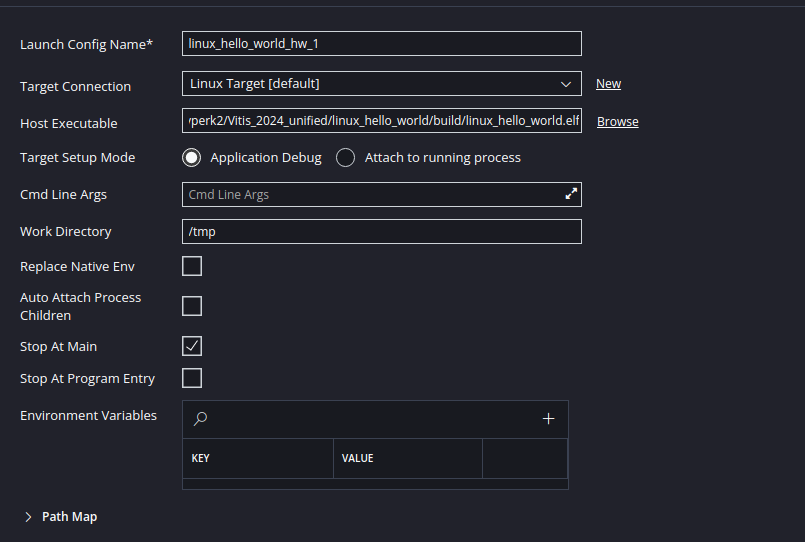

## Coding applications in Vitis
AMD provides an Integrated Development Environment (IDE) for their FPGA solutions, where all the tools needed for building and debugging software are included. This software is called Vitis and, from 2023.2 onwards, Vitis Unified IDE. This latest version of Vitis is based on Visual Studio Code interface but specially made for the AMD products.

In this section, you will code an application for the Microblaze CPU that you built in the previous session. The statement is as follows:

!!! abstract Application coding
    Code an application that takes the value of the switches through the GPIOs and puts it directly into the LEDs above the switches in the Genesys 2 board

To code this application, please take a look into how GPIO works in Linux through sysfs.

The steps to perform are as follows:
1. Open Vitis 2024.1 Unified IDE
2. Select a folder where to create your workspace

3. Create a platform project by clicking in `File -> New Component -> Platform`
   
4. Write a name for your platform like `microblaze_platform`
5. Click Next and select the same XSA that you used for building the Petalinux project.
6. Click Next and select *linux* in the operating system section. Click Next and finish.
     <br>
7. Build the platform project by clicking on the Build button
    <br>
8. Create an application project by using the Hello World Example of Linux. There is an icon in the side bar of Vitis that shows a list of possible examples to start your application. The one we are going to choose is *Linux Hello World*.
   
<br>
9. Select the built platform in the Select Platform screen.
    
!!! warning 
    If the platform you created is not shown, make sure that you clicked Build before creating the application component!

   <br>

!!! info Suggestion
    Try to run first the Hello world application before coding the application, to ensure that everything works.
10.   Build the application
11.   Connect through Ethernet the board
12.   Assign 40.0.0.1 to the PC statically
    
13.   Assign to the Genesys 2 Linux the 40.0.0.2 ip address by using the following command:
```shell
sudo ifconfig eth0 40.0.0.2
```
You can check if the IP was correctly assigned by typing the `ifconfig` command.
It should be like the screenshoot below:
 <br>
14.   Click on the cog wheel next to the Run button to open the Run settings:
      <br>
15.   Click on the New button in the Target connection. This is done to create a new connection through the ethernet link to the board
     <br>
16.   Input the IP address of the board, so 40.0.2. <br>
17.   Click on Test Connection button BEFORE clicking OK. There should be a message like this one. If there is not, the run button will not work. <br>
     <br>
    
18.   Click on the run button. The application should be running. If you run the Hellow World, there should a printed message in the debug console below.
    